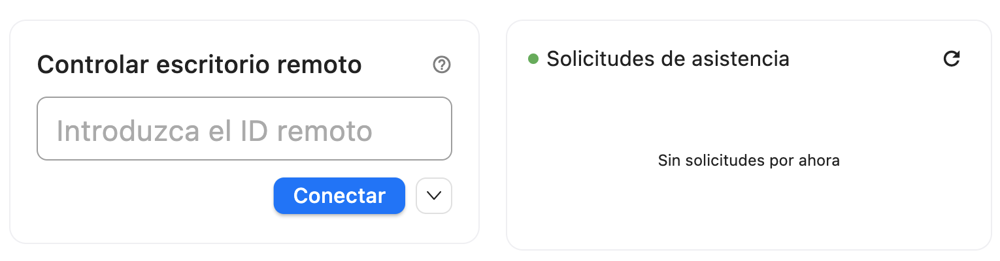
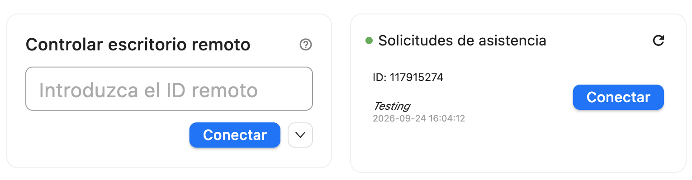

Details are still being finalized, this is *not* the final README
# Índice
1. [Información](https://github.com/bryanmoraga-ticonsultores/Soporte-Admin-TIC#información)

2. [Compilar Rustdesk (Sin Modificar) en Windows](https://github.com/bryanmoraga-ticonsultores/Soporte-Admin-TIC#compilaci%C3%B3n-paso-a-paso-windows)

3. [Compilar Rustdesk (Sin Modificar) en Mac](https://github.com/bryanmoraga-ticonsultores/Soporte-Admin-TIC#compilaci%C3%B3n-paso-a-paso-macos) 

4. [Aplicar cambios en Windows (WIP)]()

    - 4.1 [Cambios aplicados (WIP)]()
    
5. [Aplicar cambios en MacOS (WIP)](https://github.com/bryanmoraga-ticonsultores/Soporte-Admin-TIC#aplicar-cambios-en-macos)

    - 5.1 [Cambios aplicados (WIP)](https://github.com/bryanmoraga-ticonsultores/Soporte-Admin-TIC#cambios-aplicados-1)

# Información
## Soporte-Admin-TIC
Aplicación para técnicos que presten soporte remoto. 

Este proyecto toma a [`RustDesk`](https://github.com/rustdesk/rustdesk) (1.4.9) como base, añadiendo funcionalidades para el preste de servicios de soporte remoto. <br>Específicamente:<br>

- RustDesk: commit <`91c9fccbb0f7bfe5f11644d5fbdec9b23fa10540`> <br>
```bash
91c9fccbb (HEAD -> master, origin/master, origin/HEAD) chore(deps): security bumps in Cargo.lock (RUSTSEC-2026 fixes) (#16143)
nightly-177-g91c9fccbb
```
- hbb_common: commit <`29cf7cbe4d38ce36020749f713fb066299f02431`> <br>
```bash
libs/hbb_common (driver-390-g29cf7cb)
```

Para esto se necesitaría seguir las instrucciones del propio repositorio de rustdesk, que mencionaré aquí en caso de que cambien, para compilar la aplicación usando Flutter (No Sciter):

Para efectos prácticos se utilizará la herramienta [`Git Bash`](https://git-scm.com/install/windows) para el cliente de Windows.

Las herramientas base para compilar el programa, obviando la anterior mencionada, serán:

----
Herramienta | Versión | Notas
----|----|----|
Visual Studio Community | 2022 (v. 17), workload "Desarrollo para escritorio con C++" | Necesario para MSVC |
Rust(`rustup-innit.exe`) | toolchain `1.75` | El CI de RustDesk fija esta versión para la app |
LLVM | `15.0.6` | Para `bindgen`/`rust-bindgen` |
Flutter SDK | `3.24.5`(canal stable) | **NO** usar `master`/`beta`, RustDesk depende de una verión exacta |
Python 3 | cualquier reciente | Para ejecutar `build.py` |
vcpkg | commit fijo | Maneja las librerías nativas (libvpx, opus, ffmpeg, etc.)
----

Más abajo estarán seccionados los pasos a realizar para Windows y Mac (Linux en proceso)

# Compilación Paso a Paso (Windows)

### Preparación

Primero, habilitar rutas largas en Powershell como administrador, para prevenir problemas con el nombre de algunas carpetas.

```ps1
New-ItemProperty -Path "HKLM:\SYSTEM\CurrentControlSet\Control\FileSystem" \
  -Name "LongPathsEnabled" -Value 1 -PropertyType DWORD -Force
```
> Esto permite rutas de archivos superiores a 260 caracteres, que es el límite tradicional.

### Paso 1 - Visual Studio Community
----

Ahora si, como paso inicial, instalar Visual Studio 2022. <br> Tiene su truco encontrar versiones antiguas, pero aquí dejaré el enlace de `aka.ms`, dominio que utiliza microsoft.

> [!Caution]
> Descargo de responsabilidad: <br>
> El enlace es provisto del repositorio oficial de microsoft, no alojo ni reclamo autoría del programa/software. <br>
> No es mi responsabilidad el caso de que el enlace cese su funcionalidad.

https://aka.ms/vs/17/release/vs_community.exe

Durante la instalación, selecciona el workload **"Desarrollo para el escritorio con C++"**, en la sección **Móviles y de Escritorio**.


Luego, en la sección de la derecha, los únicos que son realmente necesarios son:
- `Herramientas de compilación de C++ de MSVC...`
- `Herramientas de CMake en C++ para Windows`
- `SDK de Windows 11` (o el equivalente para windows 10)


> **NO** marcar el administrador de paquetes vcpkg integrado.

### Paso 2 - Rust
----

Luego, instalar [Rust](https://rust-lang.org/es/tools/install/) compatible con tu arquitectura de sistema. Puedes revisar esto último desde el propio Git Bash:

```bash
echo $PROCESSOR_ARCHITECTURE
```
Los valores son:
- `AMD64` &rarr; arquitectura **x64**
- `x86` &rarr; arquitectura **32 BITS**
- `ARM64` &rarr; arquitectura **ARM64**

Ejecuta el archivo descargado (`rustup-innit.exe`), y prosigue con la instalación de Rust por defecto (presionando *Enter* cuando te lo pida).


Cuando se complete, en Git Bash se debe hacer esto:

```bash
source ~/.bashrc # O también `exec bash`. Esto recarga la terminal si no has cerrado la anterior
rustup install 1.75
rustup default 1.75
```

### Paso 3 - LLVM
----

Ahora hay que descargar LLVM 15.0.6. Puede ser encontrado en su [Github](https://github.com/llvm/llvm-project/releases/tag/llvmorg-15.0.6), en la sección de `Assets`, el archivo del mismo nombre correspondiente a la arquitectura de la computadora.

Luego ejecute el instalador, y siga con la instalación. 

> [!Caution]
> Cuando aparezca la opción, seleccionar "Añadir LLVM al PATH del sistema para todos los usuarios". <br>
> De esta manera, la consola podrá identificar el programa automáticamente. De otra forma habría que añadirlo al PATH de forma manual. <br>
> Siendo ese el caso: En el buscador de Windows; Editar las varables de entorno del sistema &rarr; Variables de Entorno &rarr; Variables del Sistema &rarr; Nueva... &rarr; <br> Nombre: LIBCLANG_PATH <br> Valor: <ruta_llvm>/bin <br>
> &rarr; Aceptar &rarr; Aceptar &rarr; Aplicar &rarr; Aceptar <br>
> Por defecto, la ruta de LLVM es 'C:/Program Files/LLVM/bin'

### Paso 4 - Flutter SDK
----

Ahora, el turno del SDK de Flutter

Para efectos prácticos, el SDK de Flutter quedará en `C:/src`

```bash
git clone https://github.com/flutter/flutter.git -b 3.24.5 C:/src/flutter
```

Ahora, esto se debe agregar al PATH:

>Editar las varables de entorno del sistema &darr;<br> Variables de Entorno &darr;<br> Variables del Sistema &darr;<br> Path &darr;<br> Editar... &darr;<br> Nuevo &darr;<br> Escribir (o pegar) `C:\src\flutter\bin` &darr;<br> Aceptar &darr;<br> Aceptar &darr;<br> Aplicar &darr;<br> Aceptar <br>

Cuando finalice, recargue la terminal de Git Bash (`source ~/.bashrc` o `exec bash`) para que el terminal "lea" el PATH nuevamente. Luego:

```bash
flutter doctor -v
flutter config --enable-windows-desktop
```

### Paso 5 - Python
----

Ahora, Python:<br> El repositorio oficial es https://www.python.org/downloads/windows/ <br>
Lo ideal es que sea una versión estable, y para esta guía se utilizó la versión `3.11.9` <br>
En el propio instalador, marque la opción de añadir al PATH del sistema.


> Fuente de la imagen: [All Things How](https://allthings.how/add-python-to-path-on-windows-11/)

Cuando finalice, seguimos con `vcpkg`.

### Paso 6 - VCPKG
----
Para instalar vcpkg, y los componentes necesarios, ingrese en el terminal:

```bash 
git clone https://github.com/microsoft/vcpkg C:/vcpkg
cd /c/vcpkg
git checkout 120deac3062162151622ca4860575a33844ba10b
./bootstrap-vcpkg.bat
```
>Esto descargará e instalará la versión específica requerida por RustDesk

Y agregar a las variables del sistema
> Editar las varables de entorno del sistema &darr;<br> Variables de Entorno &darr;<br> Variables del Sistema &darr;<br> Nueva... &darr;<br> Nombre: VCPKG_ROOT <br> Valor: C:/vcpkg
> &darr;<br> Aceptar &darr;<br> Aceptar &darr;<br> Aplicar &darr;<br> Aceptar <br>

Luego, de vuelta a la terminal:

```bash
export VCPKG_DEFAULT_HOST_TRIPLET=x64-windows-static
export VCPKG_VISUAL_STUDIO_PATH="C:/Program Files/Microsoft Visual Studio/2022/Community"

/c/vcpkg/vcpkg install \
  libvpx:x64-windows-static \
  libyuv:x64-windows-static \
  opus:x64-windows-static \
  aom:x64-windows-static \
  --triplet x64-windows-static
```
> Esto tarará de unos 20 a 40 minutos, dependiendo del sistema, la primera vez.

### Paso 7 - RustDesk
----

Ahora ya tenemos lo necesario, por lo que clonaremos RustDesk, usando los hash definidos al principio del documento:
```bash
git clone https://github.com/rustdesk/rustdesk.git /c/rustdesk
cd /c/rustdesk
git checkout 91c9fccbb0f7bfe5f11644d5fbdec9b23fa10540
git submodule update --init --recursive
cd libs/hbb_common
git checkout 29cf7cbe4d38ce36020749f713fb066299f02431
```

**Sólo para este paso** utilizaremos Rust en su versión estable, y no una predefinida, ya que es posible que la versión que definimos anteriormente puede fallar al descargar esta librería:
```bash
rustup install stable
rustup run stable cargo install flutter_rust_bridge_codegen --version 1.80.1 --features uuid
# Lo devolvemos a la versión requerida
rustup default 1.75 
```

Ahora, generamos el *bridge*, o puente, entre Flutter y Rust:
```bash
cd /c/rustdesk/flutter
export PATH="$PATH:/c/src/flutter/bin"
flutter pub get

~/.cargo/bin/flutter_rust_bridge_codegen \
  --rust-input ../src/flutter_ffi.rs \
  --dart-output ./lib/generated_bridge.dart \
  --llvm-path "C:/Program Files/LLVM/bin"
cd ..
```

Cuando termine, obtenemos el motor Flutter personalizado de RustDesk:

```bash
cd /c/rustdesk
flutter precache --windows

curl -L -o windows-x64-release.zip \
  https://github.com/rustdesk/engine/releases/download/main/windows-x64-release.zip

unzip windows-x64-release.zip -d windows-x64-release

cp -rf windows-x64-release/* \
  "/c/src/flutter/bin/cache/artifacts/engine/windows-x64-release/"
``` 

Y ya para compilar:
```bash
cd /c/rustdesk
export VCPKG_ROOT=/c/vcpkg
export PATH="$PATH:/c/src/flutter/bin"

# Build debug (para desarrollo)
cargo build --features flutter --lib
cd flutter && flutter run -d windows

# Build release (para ditribución/producción):
cd /c/rustdesk
python build.py --flutter
```

#### Notas importantes
---
- Cierra y reabre Git Bash después de cambiar variables de entorno del sistema, o recarga el terminal (`source ~/.bashrc` o `exec bash`)
- `VCPKG_ROOT` debe estar visible antes de compilar — si no, el build falla con error de `magnum-opus`
- `flutter` debe estar en el PATH — si no, el build falla al intentar `flutter build windows`
- Las librerías de vcpkg se reutilizan entre builds — no necesitas repetir el paso 4
- Si cambias `.rs` → recompila con `cargo build --features flutter --lib`
- Si cambias `.dart` o assets → solo presiona `r` en `flutter run` o corre `build.py` de nuevo


## Compilación Paso a Paso (MacOS)
### MacOS utilizado Ventura 13, Intel

Guía basada en un proceso realizado de compilación en macOS Ventura 13 (Intel), a partir de la [guía oficial](https://rustdesk.com/docs/en/dev/build/osx/), con los ajustes necesarios para que funcione en este entorno.

> **Nota:** los pasos de la sección [1. Entorno del sistema](#1-entorno-del-sistema-una-sola-vez) se instalan **una sola vez** por máquina. Si vas a compilar un segundo cliente (otro fork/carpeta del mismo repo), puedes saltar directo a la [sección 2](#2-por-cada-proyectocarpeta).

---

### 1. Entorno del sistema (una sola vez)

### 1.1 Xcode Command Line Tools
Para ello, se utiliza:
```bash
xcode-select --install 
```

### 1.2 Homebrew
Para esto puede seguir las instrucciones de la página oficial de [Homebrew](https://brew.sh/)
<br> O directamente con esta instrucción, obtenida de esta misma:
```sh
/bin/bash -c "$(curl -fsSL https://raw.githubusercontent.com/Homebrew/install/HEAD/install.sh)"
```

En Mac Intel, Homebrew queda en `/usr/local` y normalmente ya entra al PATH solo. En Apple Silicon habría que agregar `/opt/homebrew/bin` al PATH manualmente.

### 1.3 Xcode completo (no solo las Command Line Tools)
En Ventura 13, el App Store solo ofrece la última versión de Xcode (que pide una versión de macOS más nueva). Hay que bajar una versión compatible (15.0–15.2) desde el portal de Apple Developer:

1. Crea/usa una cuenta Apple Developer **gratuita** en https://developer.apple.com/account
2. Descarga Xcode 15.2 desde https://developer.apple.com/download/all/
3. Extrae el `.xip` (tarda varios minutos) y mueve `Xcode.app` a `/Applications`
4. Actívalo:
```sh
sudo xcode-select --switch /Applications/Xcode.app/Contents/Developer
sudo xcodebuild -runFirstLaunch
```

> No es necesario descargar los runtimes de Simulator de iOS (~7GB) si solo vas a compilar la app de macOS.

### 1.4 Herramientas base vía Homebrew
```sh
brew install python3 create-dmg nasm cmake gcc wget ninja pkg-config rustup
```

Si `rustup` falla al compilar por un error de red tipo `HTTP2 framing layer` al bajar `terminal_size` desde crates.io, instala Rust directo con el instalador oficial en su lugar:
```sh
curl --proto '=https' --tlsv1.2 -sSf https://sh.rustup.rs | sh
source "$HOME/.cargo/env"
```

Si Homebrew sí logra instalar `rustup`, queda *keg-only* (no symlinkeado por defecto). Agrégalo al PATH:
```sh
echo 'export PATH="/usr/local/opt/rustup/bin:$PATH"' >> ~/.zshrc
source ~/.zshrc
```

### 1.5 Rust
```sh
rustup install stable
rustup default 1.75.0
rustup component add rustfmt
```

Agrega también el cargo bin al PATH (necesario si `rustup` vino de Homebrew):
```sh
echo 'export PATH="$HOME/.cargo/bin:$PATH"' >> ~/.zshrc
source ~/.zshrc
```

### 1.6 vcpkg
> ⚠️ **No uses el tag `2023.04.15`** que sugiere la guía oficial — su versión de `aom` es incompatible con el `nasm` moderno que instala Homebrew (error: `Unsupported nasm: multipass optimization not supported`). Usa la rama `master`:

```sh
git clone https://github.com/microsoft/vcpkg ~/Desktop/vcpkg
cd ~/Desktop/vcpkg
./bootstrap-vcpkg.sh -disableMetrics
./vcpkg install libvpx libyuv opus aom
```

Agrega `VCPKG_ROOT` de forma **permanente** (su ausencia rompe la compilación de `magnum-opus` con `Couldn't find VCPKG_ROOT`):
```sh
echo 'export VCPKG_ROOT=$HOME/Desktop/vcpkg' >> ~/.zshrc
source ~/.zshrc
```

### 1.7 FVM (Flutter Version Management)
No lo instales vía Homebrew — la fórmula `dart-sdk` moderna requiere macOS 14+ y falla en Ventura 13. Usa el instalador oficial:
```sh
curl -fsSL https://fvm.app/install.sh | bash
echo 'export PATH="$HOME/fvm/bin:$PATH"' >> ~/.zshrc
source ~/.zshrc
```

### 1.8 CocoaPods (con Ruby de Homebrew)
El Ruby del sistema en macOS suele tener certificados SSL desactualizados, causando `certificate verify failed` al conectar a `cdn.cocoapods.org`.

```sh
brew install ruby
echo 'export PATH="/usr/local/opt/ruby/bin:$PATH"' >> ~/.zshrc
source ~/.zshrc

brew install openssl ca-certificates
echo 'export SSL_CERT_FILE=$(brew --prefix ca-certificates)/share/ca-certificates/cacert.pem' >> ~/.zshrc
source ~/.zshrc

gem install cocoapods
```

---

## 2. Por cada proyecto/carpeta

Repite esta sección por cada clon del repo (por ejemplo, si compilas varios builds personalizados desde carpetas distintas en el mismo Mac).

### 2.1 Clonar el repo
```sh
cd ~/Desktop
git clone https://github.com/rustdesk/rustdesk.git /c/rustdesk
cd /c/rustdesk
git checkout 91c9fccbb0f7bfe5f11644d5fbdec9b23fa10540
git submodule update --init --recursive
cd libs/hbb_common
git checkout 29cf7cbe4d38ce36020749f713fb066299f02431
```

### 2.2 Fijar la versión de Flutter con FVM
> ⚠️ La versión importa: **≥3.19.0** por la dependencia `xterm`, **≥3.5.0 de Dart** (viene con Flutter ≥3.24) por `extended_text`, pero **<3.47** porque el Dart SDK de versiones más nuevas ya no corre en macOS 13. La que funcionó fue **3.24.5**.

```sh
cd flutter
fvm install 3.24.5
fvm use 3.24.5
fvm global 3.24.5
fvm flutter --version   # debe mostrar 3.24.5 / Dart 3.5.4
```

### 2.3 Dependencias de Flutter
```sh
fvm flutter pub get
fvm flutter precache --macos
```

### 2.4 Venv para el paquete Python (portable)
Esto para evitar instalar paquetes en el sistema o globalmente, evitando problemas de sistema.
```sh
cd ../libs/portable
python3 -m venv venv
source venv/bin/activate
pip install --upgrade pip
pip install -r requirements.txt
cd ../..
```

### 2.5 Instalar el puente Rust↔Flutter
```sh
cargo +stable install flutter_rust_bridge_codegen --version "1.80.1" --features "uuid"
```
> Se usa `+stable` porque el toolchain 1.75.0 (el que usa el resto del build) no soporta la feature `edition2024` que requiere una dependencia transitiva de este paquete.

### 2.6 Generar el bridge
```sh
flutter_rust_bridge_codegen \
  --rust-input ./src/flutter_ffi.rs \
  --dart-output ./flutter/lib/generated_bridge.dart \
  --c-output ./flutter/macos/Runner/bridge_generated.h \
  --class-name Rustdesk
```
> ⚠️ **Siempre pasa `--class-name Rustdesk` explícitamente.** Sin este flag, el nombre de clase por defecto puede derivarse de metadatos del proyecto (pubspec, Cargo.toml, etc.) y generar algo distinto a `RustdeskImpl` — que es lo que el código Dart (`native_model.dart`, `platform_model.dart`) espera literalmente. Si no coincide, verás una cascada larga de errores de tipos que no tiene relación aparente con el problema real.

### 2.7 Pods de macOS
```sh
cd flutter/macos
pod install
cd ../..
```

### 2.8 Compilar
```sh
python3 ./build.py --flutter
```
Puede tardar 15–40 min. Es normal ver muchos `warning:` (nullability de headers de Swift/Xcode, "Run script build phase" sin outputs) — no son errores, no bloquean el build.

### 2.9 Firmar (ad-hoc)
Sin esto, macOS bloquea la app al abrir con `Library Validation failed: ... has no Team ID`:
```sh
codesign --force --deep --sign - "flutter/build/macos/Build/Products/Release/<NombreApp>.app"
```

### 2.10 Ejecutar
```sh
open "flutter/build/macos/Build/Products/Release/<NombreApp>.app"
```
o con doble click en la aplicación.

---

#### Notas finales

- Si algo falla de forma rara tras cambios de código, antes de investigar a fondo prueba una limpieza:
  ```sh
  # Flutter
  cd flutter && fvm flutter clean && fvm flutter pub get && cd macos && pod install && cd ../..
  # Rust (más lento, recompila todo)
  cargo clean
  ```

## Compilación Paso a Paso (Linux) (WIP)

## Aplicar Cambios en Windows
### Cambios aplicados


## Aplicar Cambios en MacOS
### Cambios aplicados
#### Personalizar nombre y bundle ID
Los cambios aquí presentes son los que han sido aplicados con efecto de personalizar y/o adaptar el software RustDesk a necesidades específicas.

**`src/lang/es.rs`** Se corrige un error de traducción
```rust
("Untagged", "Sin etiquetar"), // El codigo original contiene "itiquetar"
```

**`flutter/macos/Runner/Configs/AppInfo.xcconfig`**
```
PRODUCT_NAME = <NombreDeApp>
PRODUCT_BUNDLE_IDENTIFIER = <tu.identificador.unico>
```

**`flutter/macos/Runner.xcodeproj/project.pbxproj`** Usar el *`PRODUCT_BUNDLE_IDENTIFIER`* anterior en las 3 instancias que lo ocupen
```
PRODUCT_BUNDLE_IDENTIFIER = <tu.identificador.unico>
```

**`flutter/macos/Runner/AppIcon.icns`** Este es el ícono que se utilizará la `.app`
Para crear uno, se requiere una carpeta del mismo nombre, `AppIcon.iconset` y una imagen del ícono deseado en 10 tamaños.<br>Aquí un pequeño script, asumiendo el nombre del ícono `Icon.png`:
```src
mkdir AppIcon.iconset
sips -z 16 16     Icon.png --out AppIcon.iconset/icon_16x16.png
sips -z 32 32     Icon.png --out AppIcon.iconset/icon_16x16@2x.png
sips -z 32 32     Icon.png --out AppIcon.iconset/icon_32x32.png
sips -z 64 64     Icon.png --out AppIcon.iconset/icon_32x32@2x.png
sips -z 128 128   Icon.png --out AppIcon.iconset/icon_128x128.png
sips -z 256 256   Icon.png --out AppIcon.iconset/icon_128x128@2x.png
sips -z 256 256   Icon.png --out AppIcon.iconset/icon_256x256.png
sips -z 512 512   Icon.png --out AppIcon.iconset/icon_256x256@2x.png
sips -z 512 512   Icon.png --out AppIcon.iconset/icon_512x512.png
cp Icon.png AppIcon.iconset/icon_512x512@2x.png
iconutil -c icns AppIcon.iconset
rm -R AppIcon.iconset
```
Puede guardarse como un script, e.g:`CrearIcns.src`, guardarlo en una carpeta junto al `Icon.png`, y en una terminal, ir a la carpeta y ejecutarlo:
```bash
cd Ruta/a/carpeta/del/script
source CrearIcns.src
```
Esto dejará el archivo `AppIcon.icns` en dicha carpeta, teniendo que usarse en la ruta correspondiente

**`build.py`** Se agrega una función para obtener el nombre de la aplicaión de forma dinámica.
```python
def get_mac_app_name():
    xcconfig_path = 'flutter/macos/Runner/Configs/AppInfo.xcconfig'
    with open(xcconfig_path, 'r') as f:
        for line in f:
            line = line.strip()
            if line.startswith('PRODUCT_NAME'):
                name = line.split('=', 1)[1].strip()
                return f'{name}.app'
    raise Exception('No se encontró PRODUCT_NAME en AppInfo.xcconfig')
```
y se llama a esta función aquí:<br>
(fragmento)
```python
def build_flutter_dmg(version, features):
    ...

    app_name = get_mac_app_name() #<-- Aquí

    os.chdir('flutter')
    
    mac_arch = 'arm64' if platform.machine().lower() in ('arm64', 'aarch64') else 'x86_64'
    system2(
        f'FLUTTER_XCODE_ARCHS={mac_arch} FLUTTER_XCODE_ONLY_ACTIVE_ARCH=YES flutter build macos --release')
        # Para usarse aquí 
    system2(f'cp -rf ../target/release/service "./build/macos/Build/Products/Release/{app_name}/Contents/MacOS/"') 
    ...
```

**`flutter/macos/Runner.xcodeproj/project.pbxproj`** — hay 3 ocurrencias hardcodeadas que sobreescriben al `.xcconfig` si no se cambian:
```sh
sed -i '' 's/PRODUCT_BUNDLE_IDENTIFIER = com.carriez.rustdesk;/PRODUCT_BUNDLE_IDENTIFIER = <tu.nuevo.identificador>;/g' flutter/macos/Runner.xcodeproj/project.pbxproj
```

**`libs/hbb_common/src/config.rs`** (opcional, para que los textos de la UI usen tu nombre en vez de "RustDesk"):
```rust
pub static ref APP_NAME: RwLock<String> = RwLock::new("<NombreDeApp>".to_owned());
```
Y para que se conecte a un servidor personalizado propio
```rust
pub const RENDEZVOUS_SERVERS: &[&str] = &["<IP_SERVIDOR>"];
pub const RS_PUB_KEY: &str = "<KEY_SERVIDOR>";
```

**`libs/portable/Cargo.toml`** 
```toml
[package.metadata.winres]
LegalCopyright = "<CopyrightDeApp>" # Esto es para efecto de clientes personalizados
ProductName = "Nombre-de-App"
OriginalFilename = "Nombre-de-App.exe"
FileDescription = "NombreDeApp"
```

**`flutter/pubspec.yaml`** Añadir librerías necesarias para el funcionamiento de las adiciones hechas, al igual que indicar la ruta del audio añadido
```yaml
dependencies:
    audioplayers: ^5.2.1
    external_path: ^1.0.3
    web_socket_channel: ^2.4.5
(...)

flutter:
    uses-material-design: true
    assets:
        - assets/
        - assets/sound/notification.wav #<--
```

**`flutter/lib/common.dart`**
Forzar la conexión al servidor personalizado
```dart
//from local options
    ServerConfig.fromOptions(Map<String, dynamic> options)
      : idServer = options['<IP_SERVIDOR>'] ?? "",
        relayServer = options['<IP_SERVIDOR>'] ?? "",
        apiServer = options['https://<IP_SERVIDOR>'] ?? "",
        key = options['<KEY_SERVIDOR>'] ?? "";

(...)

// should set one by one
  await bind.mainSetOption(
      key: 'custom-rendezvous-server', value: "<IP_SERVIDOR>");
  await bind.mainSetOption(key: 'relay-server', value: "<IP_SERVIDOR>");
  await bind.mainSetOption(key: 'api-server', value: "https://<IP_SERVIDOR>");
  await bind.mainSetOption(key: 'key', value: "<KEY_SERVIDOR>");
```

**`flutter/lib/common/widgets/connection_page_title.dart`**
Se adapta el código a un segundo `Expanded` para evitar que el recuadro se superponga al creado.

```dart
Widget getConnectionPageTitle(BuildContext context, bool isWeb) {
  return Row(
    children: [
      Expanded(
          child: Row(
        children: [
          Expanded (
            child: AutoSizeText(
              translate('Control Remote Desktop'),
              maxLines: 1,
              overflow: TextOverflow.ellipsis,
              minFontSize: 12,
              style: Theme.of(context)
                  .textTheme
                  .titleLarge
                  ?.merge(TextStyle(height: 1)),
            ).marginOnly(right: 4),
          ),
          Tooltip(
            waitDuration: Duration(milliseconds: 300),
            message: translate(isWeb ? "web_id_input_tip" : "id_input_tip"),
            child: Icon(
              Icons.help_outline_outlined,
              size: 16,
              color: Theme.of(context)
                  .textTheme
                  .titleLarge
                  ?.color
                  ?.withOpacity(0.5),
            ),
          ),
        ],
      )),
    ],
  );
}
```

**`flutter/lib/desktop/pages/desktop_home_page.dart`**
Se oculta/comenta el widget de 'ayuda' debido a problemas visuales provocados por el mismo, al igual que el texto de instalación y el botón de actualización, para evitar confusiones y problemas de desbordamiento, volviendo el proceso más simple y directo.

```dart
Widget buildHelpCards(String updateUrl) {
    /**if (!bind.isCustomClient() &&
        updateUrl.isNotEmpty &&
        !isCardClosed &&
        bind.mainUriPrefixSync().contains('rustdesk')) {
      final isToUpdate = (isWindows || isMacOS) && bind.mainIsInstalled();
      String btnText = isToUpdate ? 'Update' : 'Download';
      GestureTapCallback onPressed = () async {
        final Uri url = Uri.parse('https://rustdesk.com/download');
        await launchUrl(url);
      };
      if (isToUpdate) {
        onPressed = () {
          handleUpdate(updateUrl);
        };
      }
      return buildInstallCard(
          "Status",
          "${translate("new-version-of-{${bind.mainGetAppNameSync()}}-tip")} (${bind.mainGetNewVersion()}).",
          btnText,
          onPressed,
          closeButton: true,
          help: isToUpdate ? 'Changelog' : null,
          link: isToUpdate
              ? 'https://github.com/rustdesk/rustdesk/releases/tag/${bind.mainGetNewVersion()}'
              : null);
    }**/
    if (systemError.isNotEmpty) {
      return buildInstallCard("", systemError, "", () {});
    }

    if (isWindows && !bind.isDisableInstallation()) {
      if (!bind.mainIsInstalled()) {
        return buildInstallCard(
            "", "", "Install",
            () async {
          await rustDeskWinManager.closeAllSubWindows();
          bind.mainGotoInstall();
        });
      } else if (bind.mainIsInstalledLowerVersion()) {
        return buildInstallCard(
            "", "", "Click to upgrade",
            () async {
          await rustDeskWinManager.closeAllSubWindows();
          bind.mainUpdateMe();
        });
      }
    }
```

**`flutter/lib/desktop/pages/connection_page.dart`**
Aquí se incluyen y se modifica el archivo para añadir los módulos originales creados para el presente cliente, los cuales se señalarán a continuación del actual.

```dart
//Importar los archivos nuevos
import 'package:flutter_hbb/desktop/pages/support_notifications.dart';
import 'package:flutter_hbb/desktop/pages/connection_footer.dart';

(...)

@override
  Widget build(BuildContext context) {
    final isOutgoingOnly = bind.isOutgoingOnly();
    return Column(
      children: [
        Expanded(
            child: Column(
          children: [
            Row(
              crossAxisAlignment: CrossAxisAlignment.start,
              children: [
                Flexible(child: _buildRemoteIDTextField(context)),
                SizedBox(width: 20),
                Expanded(child: SupportNotificationsPanel()), // Módulo nuevo
              ],
            ).marginOnly(top: 22),
            SizedBox(height: 12),
            Divider().paddingOnly(right: 12),
            Expanded(child: PeerTabPage()),
          ],
        ).paddingOnly(left: 12.0)),
        if (!isOutgoingOnly) const Divider(height: 1),
        if (!isOutgoingOnly) 
          Row(
            mainAxisAlignment: MainAxisAlignment.spaceBetween,
            crossAxisAlignment: CrossAxisAlignment.center,
            children: [
              Expanded(child: OnlineStatusWidget()),
              ConnectionFooter(), // Módulo nuevo
            ],  
          ),
      ],
    );
  }

  /// Callback for the connect button.
  /// Connects to the selected peer.
  void onConnect(
      {bool isFileTransfer = false,
      bool isViewCamera = false,
      bool isTerminal = false}) {
    var id = _idController.id;
    connect(context, id,
        isFileTransfer: isFileTransfer,
        isViewCamera: isViewCamera,
        isTerminal: isTerminal);
  }

(...)

  (
    '${translate('Terminal')} (beta)',
    () => onConnect(isTerminal: true)
  ),
  // `connect` routes this through the
  // desktop path only; the peer card gates
  // it the same way.
  /*if (isDesktop)
    (
      'TCP tunneling',
      () => onConnect(isTcpTunneling: true)
  ),*/
 ]
```

**`flutter/lib/desktop/pages/connection_footer.dart`**<br>
Este es un módulo completamente nuevo, el cual sólo añade un 'pie de página', cuya función es informar a los usuarios acerca de los Términos De Uso de esta aplicación personalizada y sobre la Privacidad de los datos.


>Adopta el widget de conexión, y al extremo derecho están los enlaces a lo mencionado anteriormente
----

**`flutter/lib/desktop/pages/support_notifications.dart`**
Este es un módulo, también completamente nuevo, el cual añade una sección a modo de widget en donde se muestran las notificaciones de solicitud de asistencia por orden de llegada, mostrando el ID del solicitante, la hora de la solicitud y un mensaje (opcional) en el cual el solicitante detalla su problemática.


>Así es normalmente, cuando no hay solicitudes
----


>Y así cuando llega una solicitud de asistencia

El botón de conexión es una llamada a la función ya existente que utiliza el propio RustDesk, la cual no ha sido modificada
